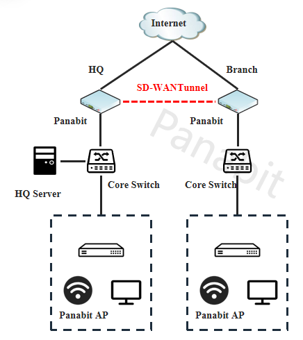
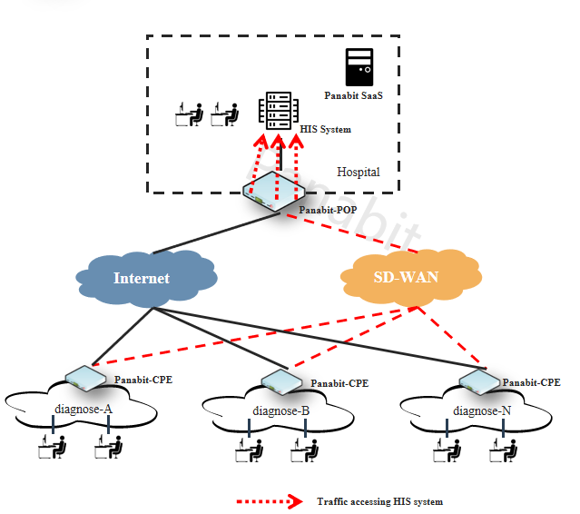
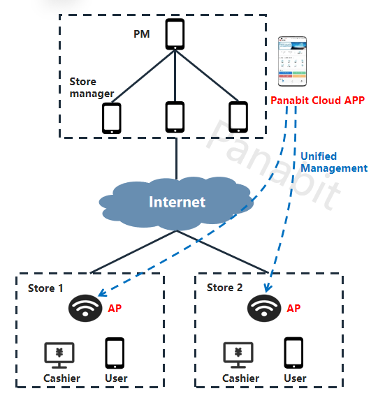
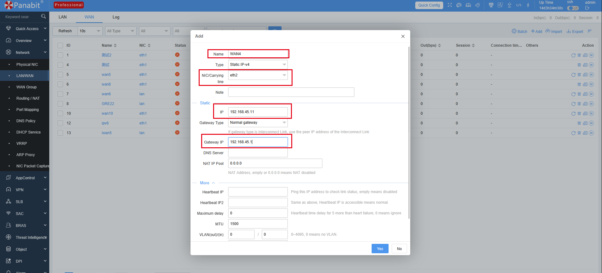
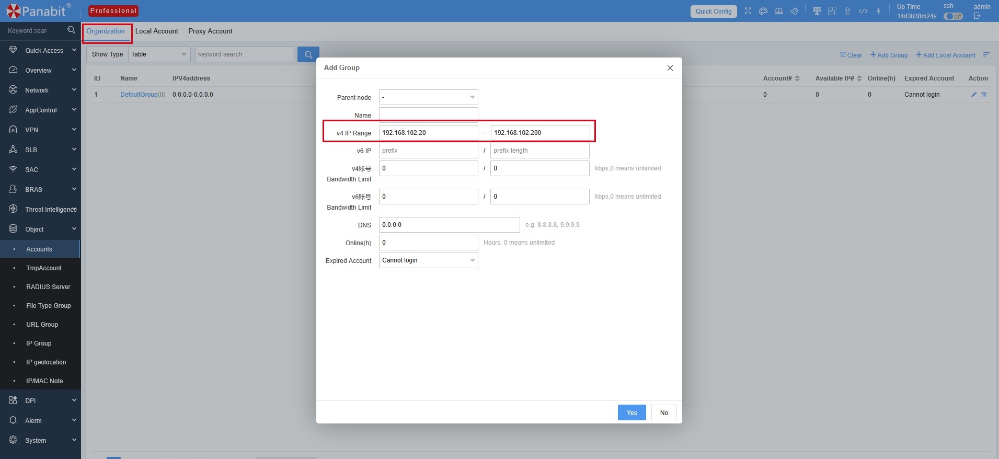
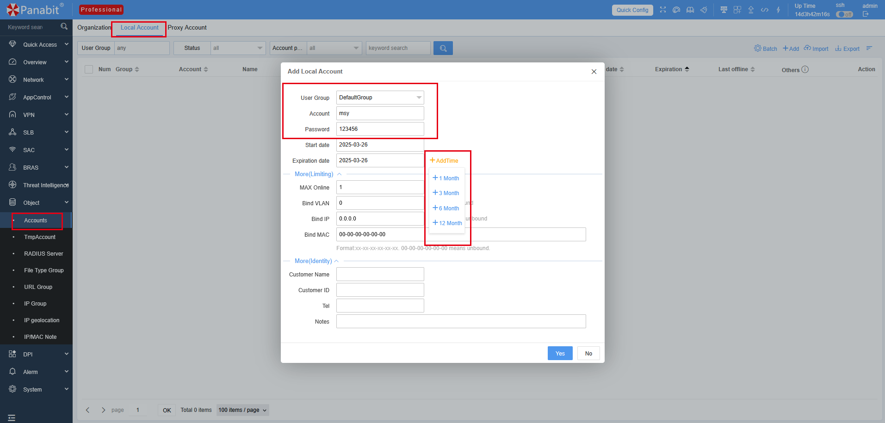
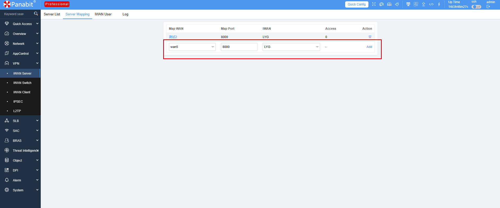
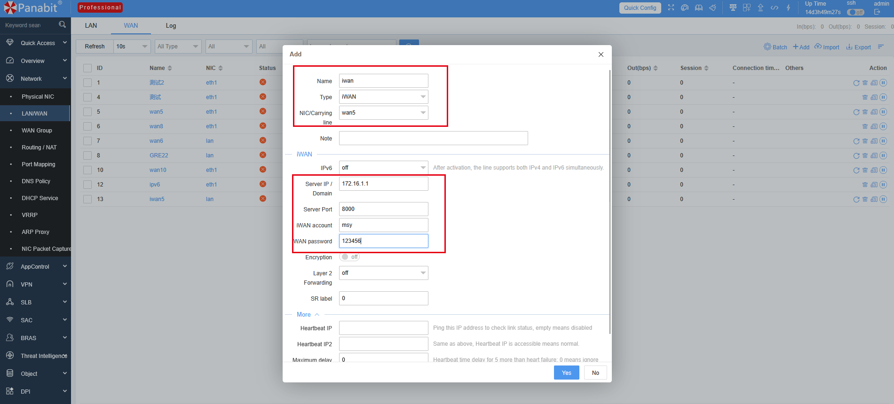

<a name="readme-top"></a>
<h1 align="center">
  
  <br>
  Panabit Intelligent Application Gateway
</h1>


<p align="center">
  <a href="README_CN.md" style="color: #007bff; text-decoration: none; font-weight: bold;">中文</a> | <span style="color: #007bff; font-weight: bold;">English</span>
</p>

---

# 📑 **Table of Contents**

- [Background](#background)
- [Next-Generation iWAN Solution](#next-generation-iwan-solution)
- [Challenges of Traditional Branch Networking](#challenges-of-traditional-branch-networking)
- [New iWAN Network Architecture](#new-iwan-network-architecture)
- [Typical Application Scenarios](#typical-application-scenarios)
  - [Enterprise Multi-Branch Interconnection](#enterprise-multi-branch-interconnection)
  - [Rural Healthcare SD-WAN Solution](#township-medical-sd-wan-solution)
  - [Chain Store WiFi Connectivity](#chain-store-wireless-interconnection)
- [iWAN Configuration Guide](#iwan-configuration-guide)
  - [iWAN Server Configuration](#iwan-server-configuration)
  - [iWAN Client Download](#iwan-client-download)
  - [iWAN Client Configuration](#iwan-client-configuration)
    - [Windows Configuration](#windows-configuration)
    - [Android Configuration](#android-configuration)
    - [iOS Configuration](#ios-configuration)
    - [Linux Configuration](#linux-configuration)
- [Contact Us](#contact-us)


---
# 📌 **Background** <a id="background"></a>

For enterprises with multiple branches or stores, **secure and stable network interconnection** is crucial. However, traditional VPN solutions face several challenges:

❌ **Complex deployment and high costs**: Long setup cycles and expensive maintenance.  
❌ **Inability to intelligently identify business traffic**: Mixing critical applications with general traffic degrades user experience.  
❌ **Cumbersome management**: Complex configurations increase operational burdens.  

## 🚀 **Next-Generation iWAN Solution** <a id="next-generation-iwan-solution"></a>
✅ **Cost-effective**: Replaces traditional leased lines, reducing network expenses.  
✅ **Intelligent traffic scheduling**: Ensures priority for critical business applications.  
✅ **Quick deployment**: One-click setup, adaptable to various network environments.  

---

# 🔥 **Challenges of Traditional Branch Networking** <a id="challenges-of-traditional-branch-networking"></a>

## 📈 **Increasing Business Traffic and Expensive Bandwidth Upgrades**
- Applications like video conferencing and AI recognition consume large amounts of bandwidth, making leased line expansion costly.

## 🚦 **Bandwidth Contention Degrades Core Business Performance**
- Critical applications share bandwidth with general traffic, causing congestion and delays.

## ⏳ **Slow Backup Line Switching and Low Resource Utilization**
- Traditional backup switching takes too long, leaving backup lines unused most of the time.

## ⚙️ **Complex Router & VPN Configurations**
- Decentralized device management increases operational costs and complexity.

---

# 🚀 **New iWAN Network Architecture** <a id="new-iwan-network-architecture"></a>

## **📌 VPN Tunneling Technology Comparison**

| **Parameter**             | **iWAN**                                                            | **Dedicated Line**                          | **IPSec**                                         | **L2TP**                                              |
|---------------------------|---------------------------------------------------------------------|---------------------------------------------|---------------------------------------------------|-------------------------------------------------------|
| **Construction Cost**     | Moderate                                                            | High                                        | Moderate                                          | Low                                                   |
| **Security**              | End-to-end                                                          | End-to-end                                  | High security, lower transmission efficiency      | No encryption, can be terminated                      |
| **Stability**             | Lightweight client integrity check, reliable connection             | Depends on fiber quality                    | Secure connection                                 | Point-to-point tunnel, average reliability            |
| **Connection Speed**      | Fast speed, supports large concurrent sessions                      | Point-to-point direct connection            | Multiple key exchanges required, average speed    | Multiple processing steps at exit, average efficiency |
| **Transmission Efficiency** | 8-byte iWAN header, high efficiency                                  | Point-to-point, relatively high efficiency | Relatively low transmission efficiency            | Point-to-point, average transmission efficiency       |


## **iWAN Solution Advantages**
✅ **Intelligent Traffic Scheduling**: Routes critical business through optimal links for better stability.  
✅ **Zero Configuration Deployment**: Supports automatic setup without manual configuration.  
✅ **High Availability**: Multi-link intelligent switching prevents network disruptions.  
✅ **Cloud-Based Centralized Management**: Unified device monitoring for simplified operations.  

## **iWAN Transmission Optimization**
- **Dynamic Path Selection**: Automatically chooses the best route based on real-time link quality.  
- **NAT Traversal**: Works in complex network environments for improved compatibility.  
- **High-Efficiency Transmission Protocols**: Reduces overhead by 30% compared to traditional VPNs for faster speeds.  
- **Intelligent Traffic Control**: Prioritizes video, voice, and office applications to ensure smooth operations.  

---

# 🔍 **Typical Application Scenarios** <a id="typical-application-scenarios"></a>

## 🏢 **Enterprise Multi-Branch Interconnection** <a id="enterprise-multi-branch-interconnection"></a>
### 📌 **Requirements**
- Secure and efficient interconnection across branches while reducing leased line costs.
- Ensure stable access to headquarters’ ERP and OA systems.

### 🔧 **Solution**
✅ Deploy **Panabit iWAN Gateway** at headquarters for centralized traffic management.  
✅ Deploy **iWAN devices** at branch locations for automatic headquarters access.  
✅ **Application-Level Traffic Control** ensures priority for ERP and OA systems.  

📌 **Diagram**


---

## 🏥 **Rural Healthcare SD-WAN Solution** <a id="township-medical-sd-wan-solution"></a>
### 📌 **Requirements**
- Efficient interconnection between rural clinics and hospitals for secure medical data transmission.
- Address poor network quality and lack of IT personnel in townships.

### 🔧 **Solution**
✅ Township hospitals act as **SD-WAN POP nodes**, with clinics connecting via iWAN tunnels.  
✅ **Remote Medical Acceleration** ensures stable operation of HIS, PACS, and imaging systems.  
✅ **Automatic Traffic Scheduling** enhances medical service experience.  

📌 **Diagram**


---

## 🍵 **Chain Store WiFi Connectivity** <a id="chain-store-wireless-interconnection"></a>
### 📌 **Requirements**
- Centralized WiFi management for nationwide stores to ensure stable POS system operation.
- Provide guest WiFi without affecting business networks.

### 🔧 **Solution**
✅ **iWAN + Small APs**: Remote management for store WiFi with QR code setup.  
✅ **Intelligent Traffic Control**: Prioritizes bandwidth for POS systems and surveillance.  
✅ **SSID Management**: Separates employee and guest networks for enhanced security.  

📌 **Diagram**


---

# ⚙️ **iWAN Configuration Guide** <a id="iwan-configuration-guide"></a>

## **iWAN Server Configuration** <a id="iwan-server-configuration"></a>
📌 **Steps**:
1️⃣ Configure **WAN Interface** and bind public IP

📌 **Diagram**
  
2️⃣ Set **Address Pool** to allocate private IPs

📌 **Diagram**
  
3️⃣ Create **iWAN Authentication Account** (Username: `test`, Password: `123456`)

📌 **Diagram**
  
4️⃣ Enable **iWAN Service** and bind authentication settings

📌 **Diagram**


---

## **iWAN Client Download** <a id="iwan-client-download"></a>

📥 **iWAN Client Download Link**: [👉 Click to Download](https://download.panabit.com:9443/ecool.php)

> 📝 **Note**: The package includes Windows, Android, and Linux versions.


---

## **iWAN Client Configuration** <a id="iwan-client-configuration"></a>
📌 **Steps**:
1️⃣ Select `iWAN` as the WAN connection type

📌 **Diagram**

2️⃣ Enter **iWAN Server Address, Port, Username, Password**  
3️⃣ Save and apply settings to automatically connect to headquarters

📌 **Diagram**    


---

## 🖥 **Windows Configuration** <a id="windows-configuration"></a>
After extraction, **double-click** `iWAN.exe` to run.

| Setting     | Description                        |
|------------|------------------------------------|
| **Server**  | IP address or domain of iWAN server |
| **Port**    | Port mapped to iWAN server       |
| **Username**| iWAN login username              |
| **Password**| Corresponding password for the username |

---

## 📱 **Android Configuration** <a id="android-configuration"></a>
After installation, **open** `iwanClient`.

| Setting     | Description                        |
|------------|------------------------------------|
| **Server**  | IP address or domain of iWAN server |
| **Port**    | Port mapped to iWAN server       |
| **Username**| iWAN login username              |
| **Password**| Corresponding password for the username |

---

## 🍏 **iOS Configuration** <a id="ios-configuration"></a>
Download and install `iwanClient` from the App Store, then **open** `iwanClient`.

| Setting     | Description                        |
|------------|------------------------------------|
| **Server**  | IP address or domain of iWAN server |
| **Port**    | Port mapped to iWAN server       |
| **Username**| iWAN login username              |
| **Password**| Corresponding password for the username |

---

## 🐧 **Linux Configuration** <a id="linux-configuration"></a>

### 📂 **Create Configuration Directory**
Before running the program, manually configure the server settings. 
Use the following command to **create the `/etc/sdwan` directory**:
```bash
sudo mkdir /etc/sdwan
sudo vim /etc/sdwan/iwan.conf
```

### 📂 **Create Configuration File**

```bash
[iwan0]
server=Server_IP
username=Login_Username
password=Password
port=Server_Port
mtu=Maximum_Transmission_Unit
encrypt=Encryption (0: No encryption, 1: Encrypted)
```

### 📤 **Upload the Program**
Use `scp` to upload the files to the backend.

### 🔑 **Grant Execution Permission**
```bash
chmod +x /root/sdwand
```

### ▶️ **Run the Program**
```bash
/root/sdwand &
```

### 🔍 **Verify iWAN Interface**
Run `ifconfig` to check the added `iwan0` interface, which should be automatically assigned an IP.

### 🚦 **Add a Static Route**
Add a static route for the iWAN network segment:
```bash
route add –net x.x.x.x/nn dev iwan0
```

---

# 📞 **Contact Us** <a id="contact-us"></a>  
🔗 Official Website: [www.panabit.com](https://www.panabit.com/)  
🔗 Forum: [bbs.panabit.com](https://bbs.panabit.com/)  
📧 Technical Support: support@panabit.com


