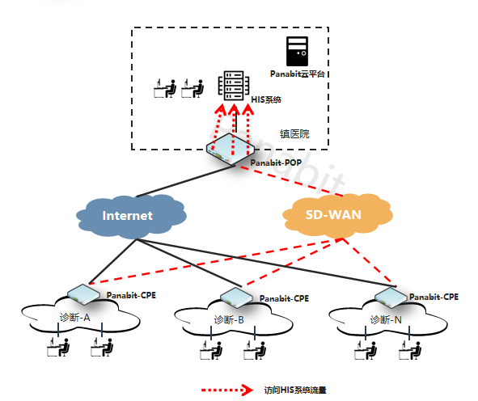
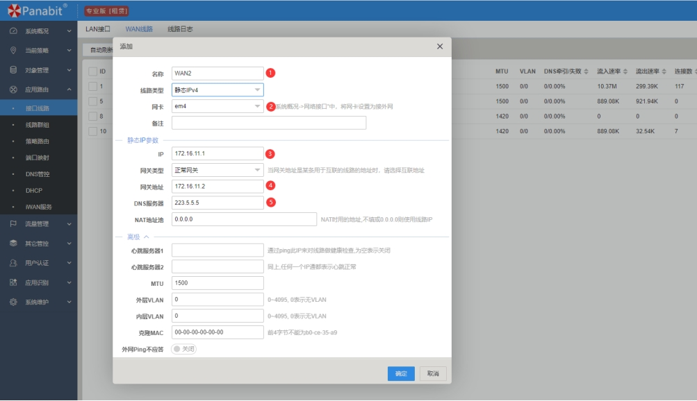
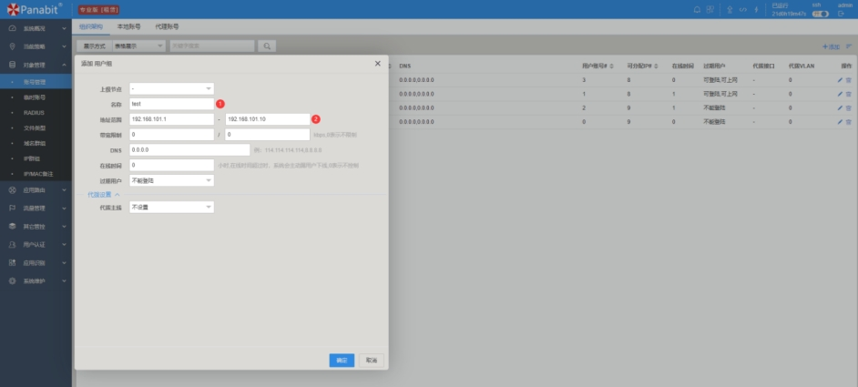
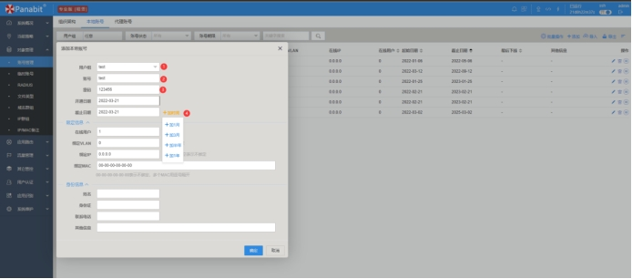
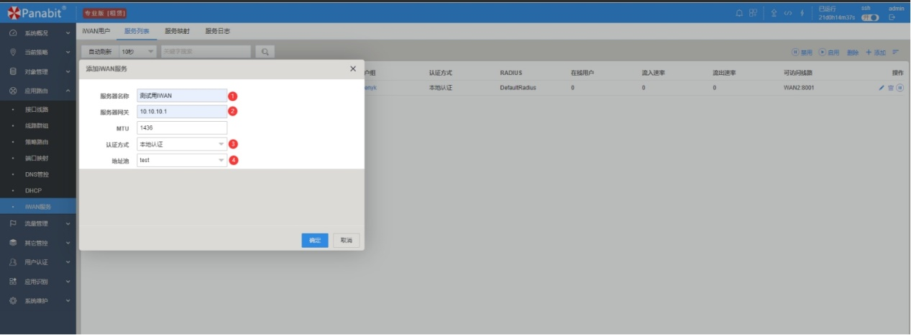
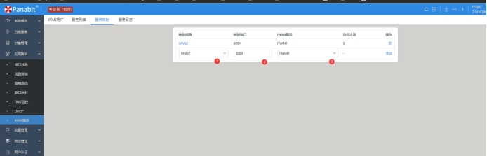
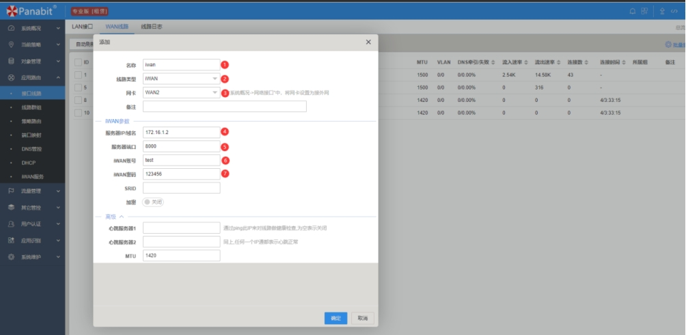

# 📌 **背景**

在企业的多分支机构或门店中，**安全稳定的网络互联** 是至关重要的。然而，传统VPN方案面临以下挑战：

❌ **开通复杂，成本高**：部署周期长，维护成本高。  
❌ **无法智能识别业务**：关键应用与普通流量混用，影响业务体验。  
❌ **管理繁琐**：配置复杂，运维人员负担重。  

## 🚀 **新一代 iWAN 解决方案**
✅ **低成本**：替代传统专线，减少网络开销。  
✅ **智能流量调度**：业务精准分流，保障核心应用。  
✅ **快速部署**：一键上线，适应不同网络环境。  

---

# 🔥 **传统分支组网的痛点**

## 📈 **业务流量激增，专线扩容成本高**
- 视频会议、AI识别等应用占用大量带宽，专线扩容费用高昂。

## 🚦 **业务抢占带宽，核心业务体验差**
- 关键应用与普通流量共用通道，网络堵塞导致业务延迟。

## ⏳ **主备线路切换慢，资源利用率低**
- 传统主备切换时间长，备用线路长期闲置，资源浪费。

## ⚙️ **传统路由器 & VPN 配置复杂**
- 设备管理分散，无法统一运维，导致管理成本高。

---

# 🚀 **新型 iWAN 组网架构**

## **📌 VPN隧道技术比较**

## **iWAN 方案优势**
✅ **智能流量调度**：关键业务走优质链路，提高稳定性。  
✅ **零配置上线**：支持自动上线，无需手动配置。  
✅ **高可用性**：多链路智能切换，避免网络中断。  
✅ **云端集中管理**：所有设备一站式监控，告别繁琐运维。  

## **iWAN 传输优化**
- **动态路径选择**：基于实时链路质量，自动选择最优路径。  
- **NAT 穿透**：适应各种复杂网络环境，提升兼容性。  
- **高效传输协议**：比传统VPN减少 30% 额外开销，速率更快。  
- **智能流控**：精准分流视频、语音、办公等业务，保障关键应用。  

---

# 🔍 **典型应用场景**

## 🏢 **企业多分支互联**
### 📌 **需求**
- 需要高效、安全的分支互联方案，降低专线成本。
- 保障关键业务（如ERP、OA系统）稳定访问总部资源。

### 🔧 **解决方案**
✅ 总部部署 **Panabit iWAN 网关**，统一管理流量。  
✅ 分支机构部署 **iWAN 设备**，自动接入总部。  
✅ 采用 **应用级流控**，保障 ERP、OA 系统优先级。  

📌 **示意图**  

---

## 🏥 **乡镇医共体 SD-WAN 解决方案**
### 📌 **需求**
- 乡镇诊所、医院间需高效互联，保证医疗数据传输安全。
- 解决乡镇网络质量差、缺乏专业IT运维的问题。

### 🔧 **解决方案**
✅ 乡镇医院作为 **SD-WAN POP点**，诊所通过 iWAN 隧道接入。  
✅ 采用 **远程诊疗加速**，保障 HIS、PACS、影像系统稳定运行。  
✅ **自动流量调度**，提升医疗业务体验。  

📌 **示意图**  

---

## 🍵 **连锁门店无线互联**
### 📌 **需求**
- 全国门店 WiFi 需要统一管理，保证收银系统稳定。  
- 提供访客 WiFi，避免影响业务网络。  

### 🔧 **解决方案**
✅ **iWAN+小派AP**：门店 WiFi 远程管理，扫码上线。  
✅ **智能流控**：收银机、监控系统优先分配带宽。  
✅ **分SSID管理**：员工、访客网络隔离，保障安全。  

📌 **示意图**  

---

# ⚙️ **iWAN 配置指南**

## **iWAN 服务器配置**
📌 **配置步骤**：
1️⃣ 配置 **WAN 接口**，绑定公网 IP。  
2️⃣ 设置 **地址池**，分配私网 IP。  
3️⃣ 创建 **iWAN 认证账号**（账号 `test`，密码 `123456`）。  
4️⃣ 启用 **iWAN 服务**，绑定认证方式。  

📌 **示意图**  

---

## **iWAN 客户端配置**
📌 **配置步骤**：
1️⃣ 选择 `iWAN` 作为WAN线路类型。  
2️⃣ 输入 **iWAN 服务器地址、端口、账号、密码**。  
3️⃣ 保存并应用配置，即可自动接入总部网络。  

📌 **示意图**  

📌 **联系我们，获取更多信息！**
获取更多信息，请访问 [Panabit 官网](https://www.panabit.com/)。
