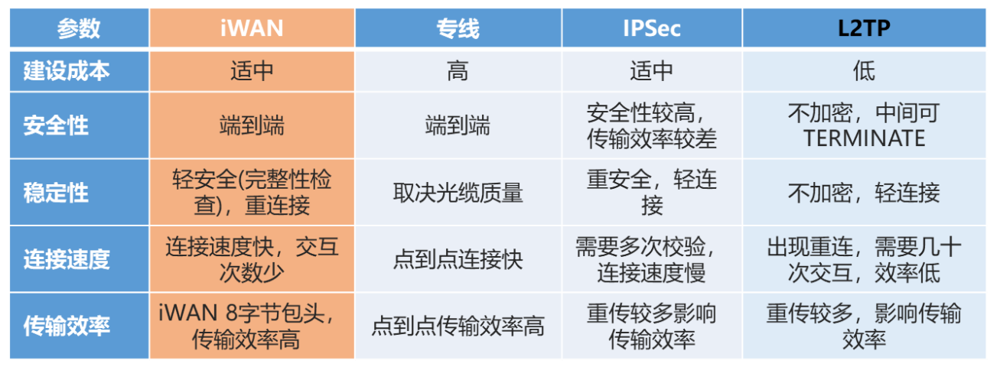
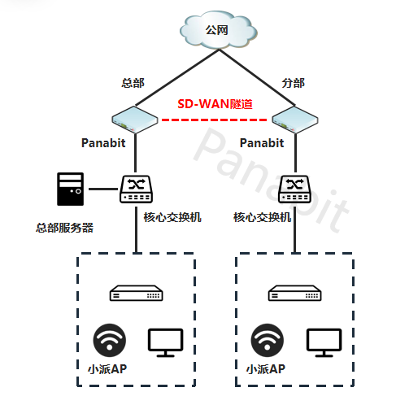
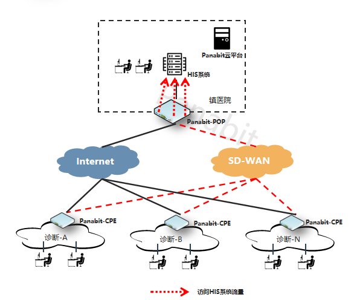
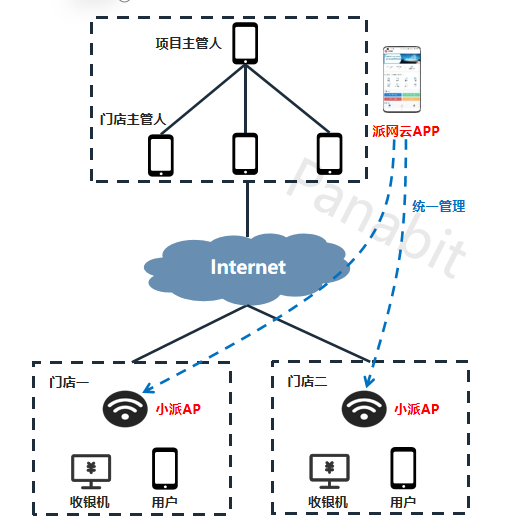
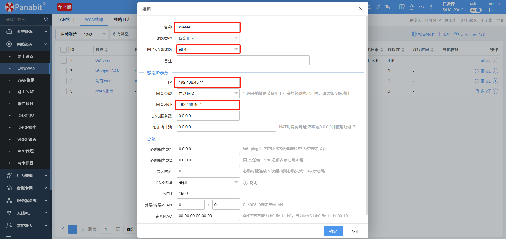
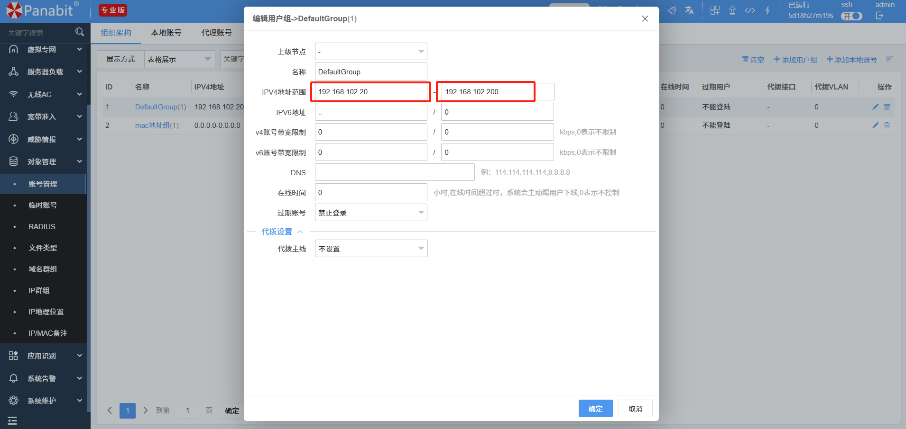
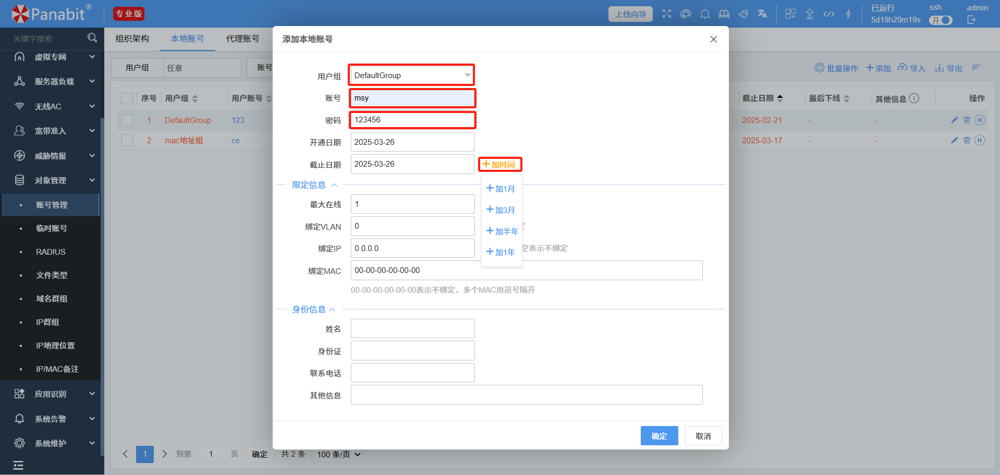
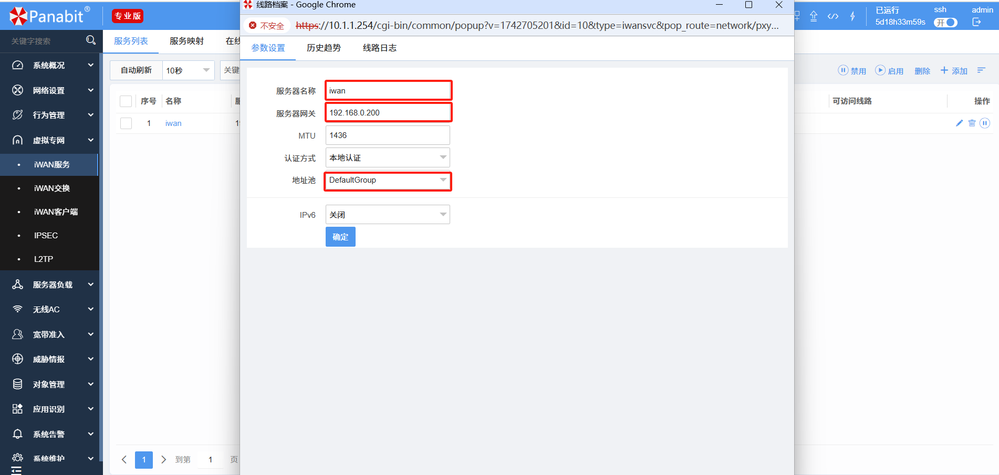
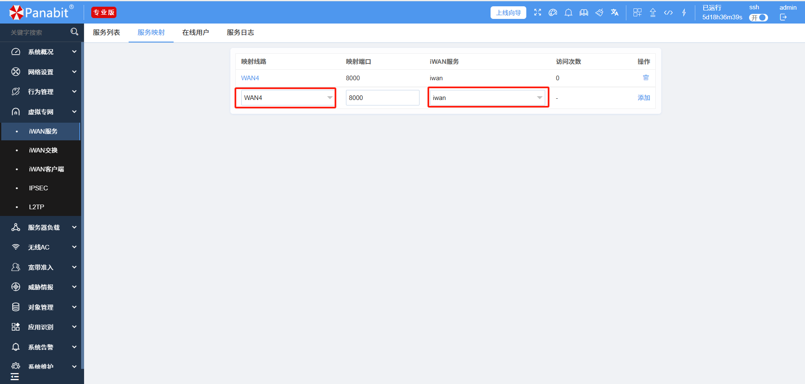
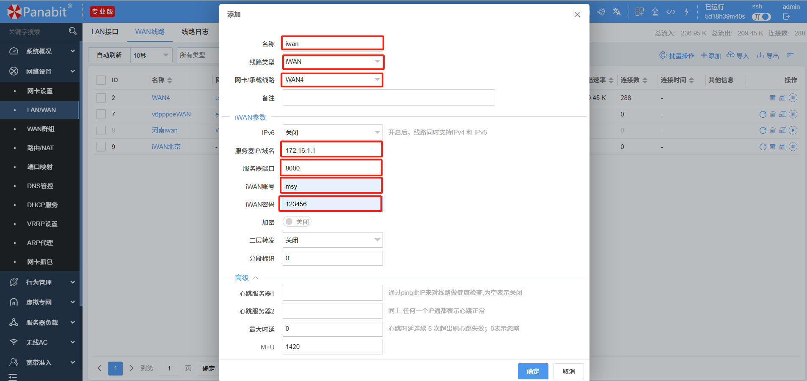

<a name="readme-top"></a>
<h1 align="center">
  
  <br>
  Panabit 智能应用网关
</h1>
<h4 align="center">出口一体化智能应用网关</h4>

<p align="center">
  <a href="README.md" style="color: #007bff; text-decoration: none; font-weight: bold;">English</a> | <span style="color: #007bff; font-weight: bold;">中文</span>
</p>

---

# 📑 **目录**

- [背景](#背景)
- [新一代 iWAN 解决方案](#新一代-iwan-解决方案)
- [传统分支组网的痛点](#传统分支组网的痛点)
- [新型 iWAN 组网架构](#新型iWAN组网架构)
- [典型应用场景](#典型应用场景)
  - [企业多分支互联](#企业多分支互联)
  - [乡镇医共体 SD-WAN 解决方案](#乡镇医共体SDWAN解决方案)
  - [连锁门店无线互联](#连锁门店无线互联)
- [iWAN 配置指南](#iWAN配置指南)
  - [iWAN 服务器配置](#iWAN服务器配置)
  - [iWAN 客户端配置](#iWAN客户端配置)
- [联系我们](#联系我们)
  
---
# 📌 **背景** <a id="背景"></a>

在企业的多分支机构或门店中，**安全稳定的网络互联** 是至关重要的。然而，传统VPN方案面临以下挑战：

❌ **开通复杂，成本高**：部署周期长，维护成本高。  
❌ **无法智能识别业务**：关键应用与普通流量混用，影响业务体验。  
❌ **管理繁琐**：配置复杂，运维人员负担重。  

## 🚀 新一代 iWAN 解决方案 <a id="新一代 iWAN 解决方案"></a>
✅ **低成本**：替代传统专线，减少网络开销。  
✅ **智能流量调度**：业务精准分流，保障核心应用。  
✅ **快速部署**：一键上线，适应不同网络环境。  

---

# 🔥 **传统分支组网的痛点** <a id="传统分支组网的痛点"></a>

## 📈 **业务流量激增，专线扩容成本高** <a id="traffic-increase"></a>
- 视频会议、AI识别等应用占用大量带宽，专线扩容费用高昂。

## 🚦 **业务抢占带宽，核心业务体验差** <a id="bandwidth-issue"></a>
- 关键应用与普通流量共用通道，网络堵塞导致业务延迟。

## ⏳ **主备线路切换慢，资源利用率低** <a id="line-switching"></a>
- 传统主备切换时间长，备用线路长期闲置，资源浪费。

## ⚙️ **传统路由器 & VPN 配置复杂** <a id="vpn-complexity"></a>
- 设备管理分散，无法统一运维，导致管理成本高。

---

# 🚀 **新型 iWAN 组网架构** <a id="新型iWAN组网架构"></a>

## **📌 VPN隧道技术比较** <a id="vpn-comparison"></a>


## **iWAN 方案优势** <a id="iwan-advantages"></a>
✅ **智能流量调度**：关键业务走优质链路，提高稳定性。  
✅ **零配置上线**：支持自动上线，无需手动配置。  
✅ **高可用性**：多链路智能切换，避免网络中断。  
✅ **云端集中管理**：所有设备一站式监控，告别繁琐运维。  

## **iWAN 传输优化** <a id="iwan-optimization"></a>
- **动态路径选择**：基于实时链路质量，自动选择最优路径。  
- **NAT 穿透**：适应各种复杂网络环境，提升兼容性。  
- **高效传输协议**：比传统VPN减少 30% 额外开销，速率更快。  
- **智能流控**：精准分流视频、语音、办公等业务，保障关键应用。  

---

# 🔍 **典型应用场景** <a id="典型应用场景"></a>

## 🏢 **企业多分支互联** <a id="企业多分支互联"></a>
### 📌 **需求** <a id="enterprise-needs"></a>
- 需要高效、安全的分支互联方案，降低专线成本。
- 保障关键业务（如ERP、OA系统）稳定访问总部资源。

### 🔧 **解决方案** <a id="enterprise-solution"></a>
✅ 总部部署 **Panabit iWAN 网关**，统一管理流量。  
✅ 分支机构部署 **iWAN 设备**，自动接入总部。  
✅ 采用 **应用级流控**，保障 ERP、OA 系统优先级。  

📌 **示意图**  


---

## 🏥 **乡镇医共体 SD-WAN 解决方案** <a id="乡镇医共体SDWAN解决方案"></a>
### 📌 **需求** <a id="rural-needs"></a>
- 乡镇诊所、医院间需高效互联，保证医疗数据传输安全。
- 解决乡镇网络质量差、缺乏专业IT运维的问题。

### 🔧 **解决方案** <a id="rural-solution-details"></a>
✅ 乡镇医院作为 **SD-WAN POP点**，诊所通过 iWAN 隧道接入。  
✅ 采用 **远程诊疗加速**，保障 HIS、PACS、影像系统稳定运行。  
✅ **自动流量调度**，提升医疗业务体验。  

📌 **示意图**  


---

## 🍵 **连锁门店无线互联** <a id="连锁门店无线互联"></a>
### 📌 **需求** <a id="store-needs"></a>
- 全国门店 WiFi 需要统一管理，保证收银系统稳定。  
- 提供访客 WiFi，避免影响业务网络。  

### 🔧 **解决方案** <a id="store-solution"></a>
✅ **iWAN+小派AP**：门店 WiFi 远程管理，扫码上线。  
✅ **智能流控**：收银机、监控系统优先分配带宽。  
✅ **分SSID管理**：员工、访客网络隔离，保障安全。  

📌 **示意图**  


---

# ⚙️ **iWAN 配置指南** <a id="iWAN配置指南"></a>

## **iWAN 服务器配置** <a id="iWAN-服务端配置"></a>
📌 **配置步骤**：
1️⃣ 配置 **WAN 接口**，绑定公网 IP

📌 **示意图**  
  
2️⃣ 设置 **地址池**，分配私网 IP

📌 **示意图**  
  
3️⃣ 创建 **iWAN 认证账号**（账号 `test`，密码 `123456`）

📌 **示意图**  
  
4️⃣ 启用 **iWAN 服务**，绑定认证方式

📌 **示意图**  



---

## **iWAN 客户端配置** <a id="iWAN客户端配置"></a>
### 🌐 **Panabit 版本部署**
📌 **配置步骤**：
1️⃣ 选择 `iWAN` 作为WAN线路类型

📌 **示意图**  

2️⃣ 输入 **iWAN 服务器地址、端口、账号、密码**  
3️⃣ 保存并应用配置，即可自动接入总部网络

📌 **示意图**  


### 🖥 **Windows 版本部署**
解压后 **双击运行** iWAN.exe 即可。

| 配置项    | 说明                          |
|-----------|-------------------------------|
| **服务器** | iWAN 服务端的 IP 地址或域名  |
| **端口号** | iWAN 服务端映射的端口号      |
| **用户名** | iWAN 的登录用户名            |
| **密码**   | iWAN 用户名对应的密码        |

---
### 📱 **安卓 版本部署**
解压安装后 **打开** iwanClient 即可。

| 配置项    | 说明                          |
|-----------|-------------------------------|
| **服务器** | iWAN 服务端的 IP 地址或域名  |
| **端口号** | iWAN 服务端映射的端口号      |
| **用户名** | iWAN 的登录用户名            |
| **密码**   | iWAN 用户名对应的密码        |

---
### [🍏 **苹果 版本部署**
请在苹果商店下载安装iwanClient客户端 **打开** iwanClient 即可。

| 配置项    | 说明                          |
|-----------|-------------------------------|
| **服务器** | iWAN 服务端的 IP 地址或域名  |
| **端口号** | iWAN 服务端映射的端口号      |
| **用户名** | iWAN 的登录用户名            |
| **密码**   | iWAN 用户名对应的密码        |

---

### 🐧 **Linux 版本部署**

#### 📂 **创建配置目录**

在运行程序前，先 **手动配置服务端信息**。  
使用以下命令 **创建 /etc/sdwan 目录**：
```bash
sudo mkdir /etc/sdwan
sudo vim /etc/sdwan/iwan.conf
```

#### 📂 **创建配置文件**

```bash
[iwan0]
server=对端ip
username=登录账号名
password=密码
port=对端端口
mtu=最大传输单元
encrypt=是否加密：0为不加密，1为加密
```

#### 📤 **上传程序**

通过 scp 工具上传文件到后台。

#### 🔑 **赋予执行权限**

```bash
chmod +x /root/sdwand
```

#### ▶️ **运行程序**

```bash
/root/sdwand &
```

####  🔍 **验证-iwan-设备**

运行 ifconfig 可以看到添加的 iwan0 接口，并且会自动分配IP。

####  🚦 **添加静态路由**

添加走 iwan 网段的静态路由：

```bash
route add –net x.x.x.x/nn dev iwan0
```

---


# 📞 **联系我们** <a id="联系我们"></a>  
🔗 访问官网：[www.panabit.com](https://www.panabit.com/)  
🔗 访问论坛：[bbs.panabit.com](https://bbs.panabit.com/)  
📧 技术支持邮箱：support@panabit.com

📞 联系我们，获取更详细的解决方案！

